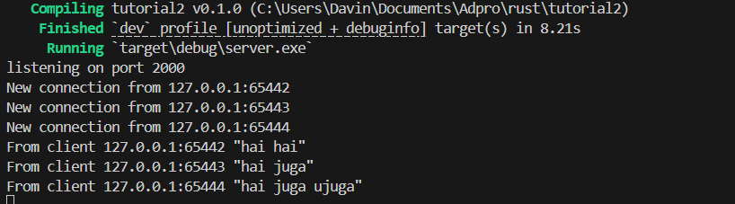
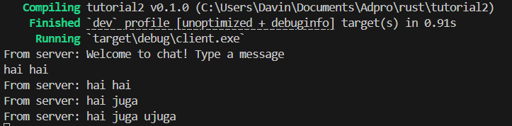
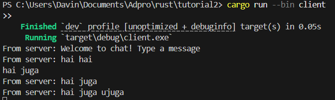
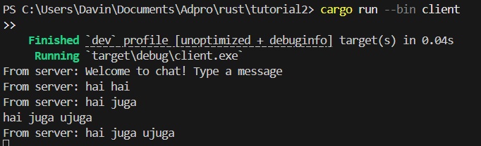
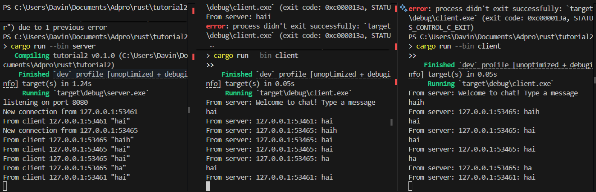

# Reflection Notes

## 2.1. Original code of broadcast chat.



Image run server ^



Image run client1 ^



Image run client2 ^



Image run client3 ^

Untuk menjalankan server, cukup ketik

`cargo run --bin server`

dan untuk client, cukup ketik

`cargo run --bin client` untuk setiap client yang ingin dijalankan.

Ketika mengetik sesuatu di client, itu akan mengirim pesan ke server, kemudian server akan mengirim balik pesan tersebut ke semua client.

## 2.2. Modifying the websocket port

Setelah mengganti port menjadi 8080 di client.rs, sekarang kita harus mengganti port di fungsi main pada server.rs menjadi 8080 juga, agar koneksi dapat tersambung.

## 2.3 Small changes. Add some information to client



Pada `server.rs`, ganti line pada fungsi handle_connection agar mengirim addr juga kepada para client.
```rust 
if let Some(text) = msg.as_text() {
    println!("From client {addr:?} {text:?}");
    bcast_tx.send(format!("{addr}: {text}"))?;
}
```